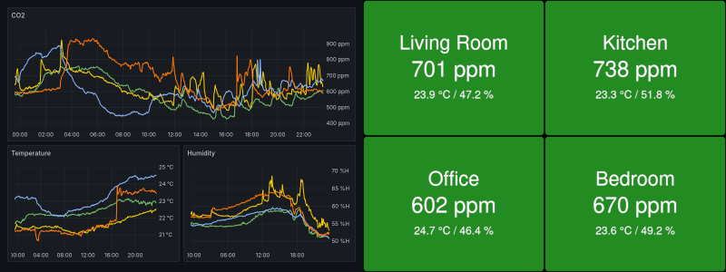
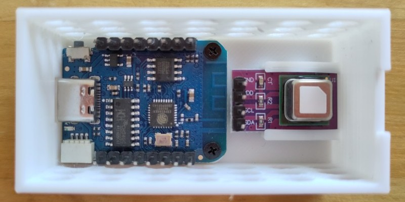

# co2-sensor

Low-cost headless CO2 sensor, based on [ESPHome](https://esphome.io/).


Grafana and HTML dashboards included.



## Components

The included [config.yaml](config.yaml) uses the following components:

- Wemos [D1 mini][] board (or clone). (Cost: ca. 2 EUR)
- Sensirion [SCD4x][] CO2 sensor module. (Cost: ca. 15 EUR)

Connecting the boards will require some soldering, and the type of wire you would like to use.

The [case](case) folder contains STL files and their [OpenSCAD][] sources for a simple 3D-printed case.

[d1 mini]: https://www.wemos.cc/en/latest/d1/d1_mini.html
[openscad]: https://openscad.org/
[scd4x]: https://developer.sensirion.com/sensirion-products/scd4x-co2-sensors/

## Assembly

Connect the D1 Mini board and CO2 sensor module as follows:

| D1 Mini Pin | CO2 Sensor Pin |
| --- | --- |
| GND | GND |
| 3V3 | VDD |
| SCL | SCL |
| SDA | SDA |



Short M2 screws (~3 mm) should work for the D1 mini board. The sensor module can simply be pushed into its holder.

## Firmware Installation

Connect the D1 Mini board to your computer via USB for the initial firmware installation.

```bash
# Create (then customize) secrets.yaml
cp secrets-example.yaml secrets.yaml
# Install firmware with standard configuration
esphome run config.yaml --no-logs
# Install firmware with custom device name
esphome -s name co2sensor42 run config.yaml --no-logs
```

After connecting to your Wifi network, the ESPHome web interface should be available at http://co2sensor (or your custom device name).

## Monitoring

Prometheus metrics should be available at http://co2sensor/metrics (or your custom device name).

The [grafana](grafana) folder contains example Grafana dashboards.

The [hackydash](hackydash) folder contains a simple HTML dashboard.

## Sensor Calibration

By default, the SCD4x performs `Automatic Self-Calibration` (ASC), and does not need to be calibrated manually. However, the data sheet contains this note:

> The automatic self-calibration algorithm assumes that the sensor is exposed to the atmospheric CO2 concentration of 400 ppm at least once per week.

If sufficient ventilation cannot be ensured, it might become necessary to perform `Forced Recalibration` (FRC) using a reference value. The ESPHome web interface contains an `FRC` button for performing the calibration, and an `FRC Reference` slider for setting the reference value. Before calibration, the data sheet suggests:

> Operate the SCD4x in the operation mode later used in normal sensor operation (periodic measurement, low power periodic measurement or single shot) for > 3 minutes in an environment with homogenous and constant CO2 concentration.

The FRC functionality can be disabled by setting the variable `frc` to `disabled`.

---

Trans Rights are Human Rights! 🏳️‍⚧️ 🏳️‍🌈
