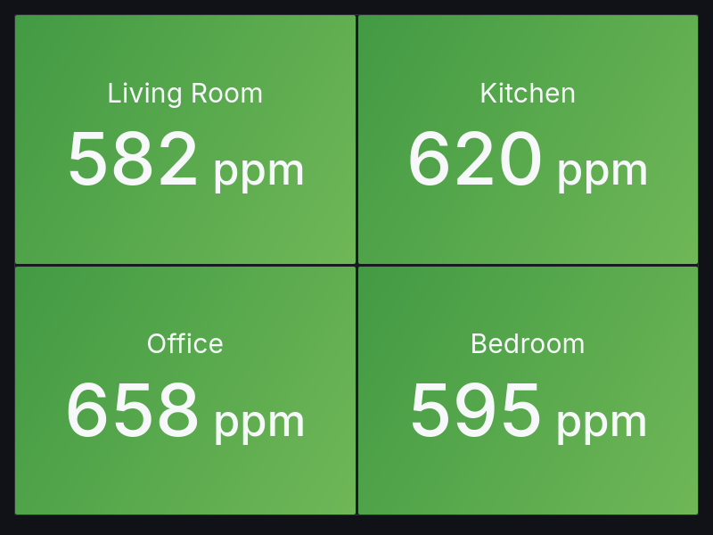
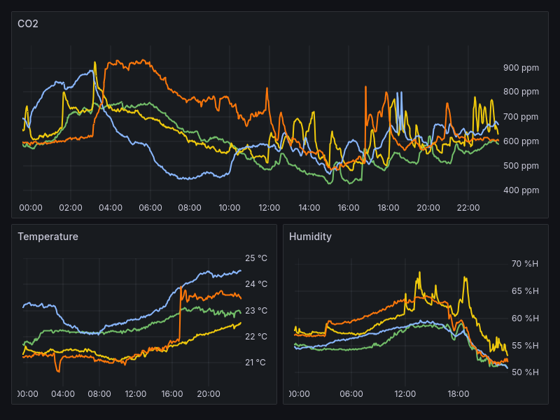

# Grafana Dashboards

## CO2 Levels

The `CO2 Levels` dashboard shows "traffic light" style panels for each sensor:



The dashboard in the screenshot has been modified to use a `location` label in the legend, which has been added via `prometheus.yml`:

```yaml
scrape_configs:
  - job_name: esphome
    # ...
    metric_relabel_configs:
      - source_labels: ["instance"]
        regex: "co2sensor01.*"
        replacement: "Living Room"
        target_label: "location"
      - source_labels: ["instance"]
        regex: "co2sensor02.*"
        replacement: "Kitchen"
        target_label: "location"
      - source_labels: ["instance"]
        regex: "co2sensor03.*"
        replacement: "Office"
        target_label: "location"
      - source_labels: ["instance"]
        regex: "co2sensor04.*"
        replacement: "Bedroom"
        target_label: "location"
```

## CO2 Sensors

The `CO2 Sensors` dashboard shows line charts for CO2, temperature, and humidity:


