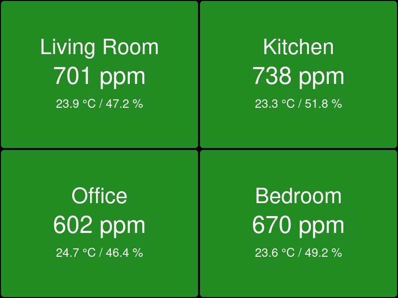

# HTML Dashboard

The HTML dashboard shows "traffic light" style panels for each sensor:

The display of temperature and humidity can be disabled in the config file.

Usage:

1. Copy `config-example.json` to `config.json` and add your sensors.
1. Add your own CSS as `custom.css`. (Optional)
1. Serve the files via HTTP.
   (For example, run `python3 -m http.server --bind localhost` and open <http://localhost:8000>.)

Depending on your web browser, you may need to disable HTTPS-Only mode for the
dashboard URL, the sensor URLs, or both.
